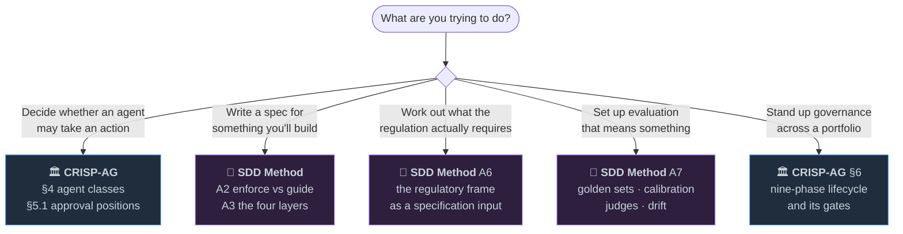

# Agentic Best Practices

**Two frameworks for specifying and governing agentic AI systems —
published as general best-practice guidance.**

*David Reed, PhD*

---

## What's here

| | Document | It answers |
|---|---|---|
| 🏛️ | **[CRISP-AG](CRISP-AG.md)** — Comprehensive Risk & Implementation Standard for Practical Agentic Governance | *"What is this agent allowed to do, and who approves it?"* |
| 📐 | **[Specification-Driven Design for Agentic Systems](SDD-Method.md)** — the method | *"How do I write a specification that actually constrains what gets built?"* |

They fit together. CRISP-AG classifies agents by consequence and assigns each action an
approval position. The SDD method is how you write the specification that holds an agent
to it.

---

## The idea both are built on

> A mechanism **enforces** when it can refuse — a schema validator, a permission rule, a
> deterministic check, a failing test, a blocking hook. It **guides** when it can only
> influence — prompt text, instruction files. *Never let a guiding mechanism be the only
> thing standing between a hazard and an outcome.*

Most of what follows in both documents is a consequence of taking that seriously.

---

## Where to start

**In a hurry?** Read the SDD method's **A2** (~640 words) and CRISP-AG's **§4** (~480
words). Between them they give you the two distinctions everything else hangs on: what
can refuse versus what can only suggest, and how much damage this agent could do.

---

## What these documents are, and are not

**They are** a method and a governance framework, written to be applied. Both carry
worked examples concrete enough to argue with, and both cite their sources.

**They are not** a compliance product or legal advice. Both describe regulatory
instruments as inputs that generate requirements; what any instrument requires of *your*
system is a question for your own counsel.

**On the evidence.** Both documents are explicit about the strength of what they cite.
The empirical record on specification-driven work is young — small studies, preprints,
practitioner reports — and the text says so where it matters rather than overclaiming.
Numeric thresholds are defensible defaults with citations, meant to be replaced by
measured ones.

---

## Editions

These are brand-neutral editions. They carry the method and the framework, with every
illustration set in a neutral worked example and every requirement stated inline rather
than cited by an identifier, so each document stands on its own.

Organisation-specific material — a fully worked system specification and a platform
playbook — is not included. That material describes an operating model rather than a
method, and would not have been made general by renaming.

---

## Citing

> Reed, D. (2026). *CRISP-AG: Comprehensive Risk & Implementation Standard for Practical
> Agentic Governance*, v3.0, public edition.

> Reed, D. (2026). *Specification-Driven Design for Agentic Systems: The Method*,
> v1.0.2, public edition.

---

Questions, corrections and disagreements are welcome — open an issue.

