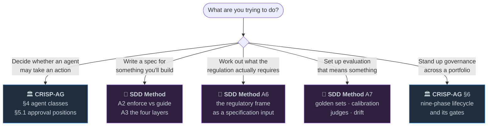

# Agentic Best Practices

**Two frameworks for specifying and governing agentic AI systems —
published as general best-practice guidance.**

*David Reed, PhD*

---

## What's here

| | Document | It answers |
|---|---|---|
| 🏛️ | **[CRISP-AG](https://drdavidreed.com/papers/crisp-ag/)** — An Artifact-Centered Framework for Enterprise Agentic AI Governance | *"What is this agent allowed to do, and who approves it?"* |
| 📐 | **[Specification-Driven Design for Agentic Systems](https://drdavidreed.com/papers/specification-driven-design/)** — the method | *"How do I write a specification that actually constrains what gets built?"* |

They fit together. CRISP-AG classifies agents by consequence and assigns each action an
approval position. The SDD method is how you write the specification that holds an agent
to it.

---

## The idea both are built on

> A mechanism **enforces** when it can refuse — a schema validator, a permission rule, a
> deterministic check, a failing test, a blocking hook. It **guides** when it can only
> influence — prompt text, instruction files. *Never let a guiding mechanism be the only
> thing standing between a hazard and an outcome.*

Most of what follows in both documents is a consequence of taking that seriously.

---

## Where to start

```mermaid
flowchart TD
    A([What are you trying to do?]) --> Q{ }
    Q -->|"Decide whether an agent<br/>may take an action"| C["🏛️ <b>CRISP-AG</b><br/>§4 agent classes<br/>§5.1 approval positions"]
    Q -->|"Write a spec for<br/>something you'll build"| S["📐 <b>SDD Method</b><br/>A2 enforce vs guide<br/>A3 the four layers"]
    Q -->|"Work out what the<br/>regulation actually requires"| R["📐 <b>SDD Method</b> A6<br/>the regulatory frame<br/>as a specification input"]
    Q -->|"Set up evaluation<br/>that means something"| E["📐 <b>SDD Method</b> A7<br/>golden sets · calibration<br/>judges · drift"]
    Q -->|"Stand up governance<br/>across a portfolio"| L["🏛️ <b>CRISP-AG</b> §6<br/>nine-phase lifecycle<br/>and its gates"]

    style C fill:#1f2d3d,stroke:#58a6ff,color:#c9d1d9
    style L fill:#1f2d3d,stroke:#58a6ff,color:#c9d1d9
    style S fill:#2d1f3d,stroke:#bc8cff,color:#c9d1d9
    style R fill:#2d1f3d,stroke:#bc8cff,color:#c9d1d9
    style E fill:#2d1f3d,stroke:#bc8cff,color:#c9d1d9
```

**In a hurry?** Read the SDD method's **[A2](https://drdavidreed.com/papers/specification-driven-design/#a2-the-organizing-distinction-what-enforces-and-what-guides)** (~1,300 words) and CRISP-AG's **§4** (~750
words). Between them they give you the two distinctions everything else hangs on: what
can refuse versus what can only suggest, and how much damage this agent could do.

---

## What these documents are, and are not

**They are** a method and a governance framework, written to be applied. Both carry
worked examples concrete enough to argue with, and both cite their sources.

**They are not** a compliance product or legal advice. Both describe regulatory
instruments as inputs that generate requirements; what any instrument requires of *your*
system is a question for your own counsel.

**On the evidence.** Both documents are explicit about the strength of what they cite.
The empirical record on specification-driven work is young — small studies, preprints,
practitioner reports — and the text says so where it matters rather than overclaiming.
Numeric thresholds are defensible defaults with citations, meant to be replaced by
measured ones.

---

## Where the documents live

Both documents now live on drdavidreed.com as Parts 1 and 3 of a seven-paper series,
*[Agentic AI Governance in Practice](https://drdavidreed.com/papers/)*. The published
pages are the current, maintained versions. `CRISP-AG.md` and `SDD-Method.md` in this
repository are short pointers to them.

The Specification-Driven Design paper now carries more than the method. Part B is an
illustrative worked example, specified in full, and Part C is a build playbook. The
other five papers in the series cover the requirements standard, the harness, security
and vendor-control specifications, and the delivery workflow that binds them.

---

## Citing

> Reed, D. (2026). *CRISP-AG: An Artifact-Centered Framework for Enterprise Agentic AI
> Governance* (Version 3.0). Agentic AI Governance in Practice, Part 1.
> https://drdavidreed.com/papers/crisp-ag/

> Reed, D. (2026). *Specification-Driven Design for Agentic Systems* (Version 1.0.3).
> Agentic AI Governance in Practice, Part 3.
> https://drdavidreed.com/papers/specification-driven-design/

---

Questions, corrections and disagreements are welcome — open an issue.

